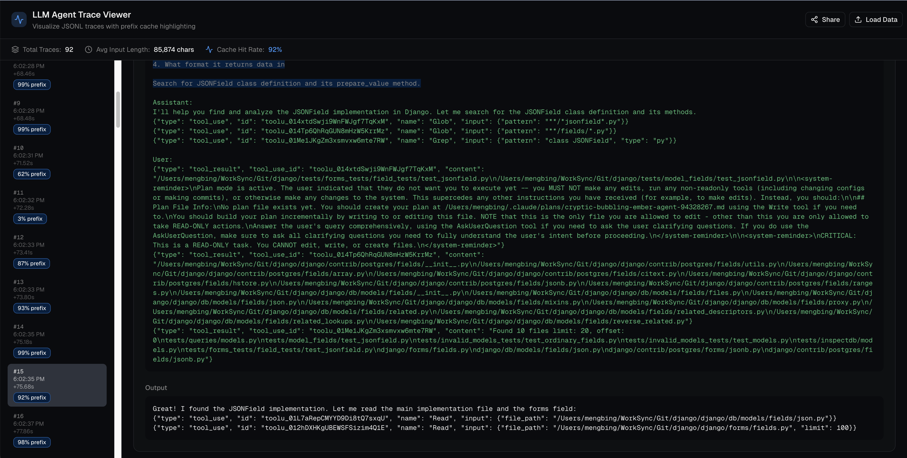

# Context Engineering & Reuse Pattern under the hood of Claude Code

Over the last few months, [Claude Code](https://www.claude.com/product/claude-code) has quietly become one of the most interesting & widely-adopted real-world agentic systems available to normal developers.

Unlike ***cloud-only agents*** whose internals remain hidden behind API gateways like [Perplexity](https://www.perplexity.ai/api-platform), [Devin](https://devin.ai/), or [Manus](https://manus.im/), nor as fully ***open source agents*** like [Mini SWE Agent](https://github.com/SWE-agent/mini-swe-agent) or [Terminus 2](https://github.com/laude-institute/harbor/blob/main/src/harbor/agents/terminus_2/terminus_2.py) where you can deploy locally with source code, Claude Code runs ***partially locally*** — it has a open-sourced [client repo](https://github.com/anthropics/claude-code) running on the local machine, which gives us a rare opportunity: to inject the traffic it sends and reverse engineering **to see every single LLM call**, every intermediate **tool invocation**, every tiny decision the agent makes.

Recently, we ran a tiny one-shot experiment with Claude Code and captured everything into a **raw** log file: [**`claude_code_trace.jsonl`**](https://github.com/kobe0938/blog/blob/master/claude-code/claude_code_trace.jsonl). If you put this into the [visualizer](https://v0-llm-agent-dashboard.vercel.app/), you can see the trace. In total, it invokes 92 llm calls(#1-#92), consumes ~2M input tokens in total and lasts for 13 minutes. The total prefix reuse rate is 92%.

The goal was simple:

> If you give Claude Code one small task, what exactly happens behind the scenes?
>
> Which LLM calls get made? In what order?
>
> Where does context get reused? And how much of the prompt is stable prefix(seen) vs incremental content(new)?

This is our walk-through of that trace.

---

# **1. What “Actually Happens” When Claude Code Runs a Simple Task**

Claude Code feels straightforward as a product — you type a request in your editor, it edits files or runs some bash commands. But under the hood, even a simple one-step request decomposes into a surprisingly structured internal loop.

We randomly select one [task](https://huggingface.co/datasets/princeton-nlp/SWE-bench_Verified/viewer/default/test?views%5B%5D=test&row=80) from the [SWE-bench_Verified](https://huggingface.co/datasets/princeton-nlp/SWE-bench_Verified) dataset. The problem set up is to fix one problem in the django/django repo from commit 2e0f04507b17362239ba49830d26fec504d46978. The problem statement is:

> *"JSONField are not properly displayed in admin when they are readonly.
> Description
> JSONField values are displayed as dict when readonly in the admin.
> For example, {"foo": "bar"} would be displayed as {'foo': 'bar'}, which is not valid JSON.
> I believe the fix would be to add a special case in django.contrib.admin.utils.display_for_field to call the prepare_value of the JSONField (not calling json.dumps directly to take care of the InvalidJSONInput case).
> "*

And this is the exactly the prompt that Claude Code received.

Surprisingly, before any fancy reasoning, Cluade Code ran a couple of "Warm up" steps(trace id#2, #3, #4) before the actual task. Warm up steps do nothing but just input the prompt for tool list(#2), explore subagent(#3), and plan subagent(#4). Warm up steps are used for cache purposes as later when those tools and subagents being called, the cache will be hit, which results in faster response time. The summization agent(#1) and new topic agent(#5) are used for summarizing the context and generating a new title for displaying - just as the chatgpt sidebar works.

The main agent(#6) comes with a huge system prompt, including git history, status, tool list, etc. The 18 tools in the tool list not only has the ability to use normal tool calls like Bash, Grep, Read, WebFetch, AskUserQuestion, etc. It also has the ability to invoke and delegate certain tasks for subagents like Explore subagent(#7), Plan subagent(#46), where those subagents will invoke tool calls from their tool list.

Immediately after the main agent(#6), it invokes the Explore(also called file search agent) subagent(#7), which will invoke tool calls from its tool list to explore the codebase, which starts with a different system prompt where it's main goal is to explore the codebase:

> You are Claude Code, Anthropic's official CLI for Claude. You are a file search specialist for Claude Code, Anthropic's official CLI for Claude. You excel at thoroughly navigating and exploring codebases.

Interestingly, the Explore subagent(*#7*) is not the only subagent that Claude Code can invoked. Instead, it invokes 3 Explore subagents(lifespan: #7 - #26, #8 - #37, #9 - #45) in parallel to explore the codebase, each with a different goal: 1. Explore JSONField implementation; 2. Explore admin display_for_field; 3. Explore readonly field rendering. The context of the main agent(#6) is not carried to the subagents, which is a good thing for the subagents to have a fresh start. Each Explore subagent can invoke **1-3** tools **in parallel**, where the tools are from the tool list of the Explore subagent, which is only a subset(**10/18**) of the main agent's tool list. The [ReAct](https://arxiv.org/pdf/2210.03629) mechanism is used here, where the Explore subagent will invoke a tool call, and then based on the tool output, it will observe and invoke another tool call to explore the codebase further until it deems it has explored enough.

Finally, after the slowest Explore subagents finished its exploration at step #45, at step #46, the main agent appends the findings(summerizations) from all 3 Explore subagents to the context, and then invokes the Plan subagent(#47) to plan the fix.

---

Similar to Explore Agent, Plan Agent(#47) also has a different system prompt, where it's main goal is to plan the fix:

> You are Claude Code, Anthropic's official CLI for Claude. You are a software architect and planning specialist for Claude Code. Your role is to explore the codebase and design implementation plans.

The plan agent did not carry all the context from the main agent nor the Explore subagents, which is a good thing for the plan agent to have a fresh start. Instead, it only contains the summerization of the Explore subagents' findings. The tool box is the same as the main agent's tool box, which is only a subset(**10/18**) of the main agent's tool list. The goal for the plan agent is to design an implementation plan that:

> Please design an implementation plan that:
>
> 1. Identifies the exact changes needed to display_for_field
> 2. Considers whether we need to instantiate a form field from the model field or if there's a better approach
> 3. Identifies any edge cases or potential issues
> 4. Recommends the best approach given Django's architecture

---

Similarly, the plan agent also follows the ReAct pattern and loop the tool calling from #47 to #72, where the context accumulates from 11,552 tokens to 38,819 tokens. After having a good plan(see details in #72 about the plan), the plan agent will return to the main agent(#73) with the plan. The main agent will then invoke a series of tool calls to review the plan(#73), ask user for clarification(#74), and write the plan into a md file(#75). Finally, the main agent will exit the plan mode(#76) and enter the execute mode(#77) to execute the plan after interactively ask user for plan approval(#76-#77).

The execution phase(#77-#91) still follows the ReAct pattern. The main agent will use the plan markdown file as a todo list.

> 1. Add json import to utils.py
> 2. Add JSONField handling to display_for_field()
> 3. Add tests to test_admin_utils.py
> 4. Run the tests to verify

After executing some tool calls to read or edit file, it will cross out the todo items in the plan markdown file. Once all the todo items are crossed out, the main agent will end with a conclusion message(#92). During the phase, there are some other subagents being invoked: e.g. Extract Bash Command subagent(#93), where there's only a one shot prompt template for the subagent to extract the bash command from bash command in order to not run 'rm' without user confirmation by accident.

---

# **2. The Secret Pattern: Claude Code Is a Prefix Reuse Machine**

During our trace analysis, one phenomenon was so consistent it deserves its own section:

> **Claude Code’s prompts are extremely prefix-heavy.**

Prefix reuse means that one part of the prompt prefix is seen in the previous prompts' prefix. Across all phases, the prompt reuse rate is extremely high: 92%. For ReAct based subagent loops, it's even higher. If we run prefix-length analysis in paticular sections:

| Call    | Total tokens | Shared prefix % | Notes %                    |
| ------- | ------------ | --------------- | -------------------------- |
| #1-#6   | 47177        | 0.22%           | Warm up and initial phase  |
| #7-#45  | 546104       | 92.06%          | Explore subagent phase     |
| #47-#72 | 528286       | 93.23%          | Plan subagent phase        |
| #73-#92 | 827411       | 97.83%          | Main agent execution phase |

What does this mean? Claude Code’s architecture practically **optimizes itself for KV cache reusage** , even without explicitly trying.

---

# **3. What is prefix caching and why should I care?**

At the heart of Large Language Model inference lies the **KV cache** (key-value cache) — a mechanism that stores intermediate attention computation results for previously processed tokens. During autoregressive generation, each new token needs to attend to all previous tokens, requiring expensive matrix multiplications. The KV cache stores the key and value matrices computed for earlier tokens, so they don't need to be recomputed with each new token. **Prefix caching** leverages this by recognizing that when multiple requests share the same prompt prefix (like system instructions or document context), their KV cache computations are identical and can be reused across requests. Major LLM providers have turned this into significant cost savings: [OpenAI&#39;s Prompt Caching](https://platform.openai.com/docs/guides/prompt-caching) handles prefix caching **automatically** — it detects common prefixes longer than 1,024 tokens and caches them transparently, offering a **90% discount** on cached input tokens (e.g., GPT-5.2 drops from $1.75 to $0.175 per million cached tokens). In contrast, [Anthropic&#39;s cache hit pricing](https://docs.anthropic.com/en/docs/build-with-claude/prompt-caching) gives developers **explicit control** over which prompt blocks to cache using special `cache_control` markers, charging a slightly higher cache write cost (1.25x base price for 5-minute cache, 2x for 1-hour cache) but delivering the same **90% discount** on cache reads (Claude Sonnet 4.5: $0.30 per million tokens for cache reads versus $3.00 for base input), allowing fine-grained optimization for complex multi-turn conversations or document-heavy workflows.

To put this in perspective with Claude Code's 92% prefix reuse pattern: processing 2M input tokens(our consumption for the experiment) **without caching** would cost **$6.00** (2M × $3/MTok), but **with prefix caching**, the cost drops to just **$1.152** (1.84M cache hits × $0.30/MTok + 0.16M cache writes × $3.75/MTok) — a savings of **$4.85 (81% reduction)** over one simple task.

Open-source inference engines have also embraced this paradigm: [vLLM&#39;s automatic prefix caching](https://docs.vllm.ai/en/latest/design/automatic_prefix_caching.html) transparently caches shared prefixes using its PagedAttention mechanism, [SGLang&#39;s RadixAttention](https://docs.sglang.io/) employs a radix tree data structure to efficiently match and reuse the longest common prefixes across requests, and [LMCache](https://lmcache.ai/) takes distributed KV caching even further by pooling cache storage across multiple nodes to maximize reuse at scale. Beyond cost savings, prefix cache hits dramatically reduce **TTFT (time to first token)** — since the model can skip recomputing the entire prefix and only process the unique suffix, latency for subsequent requests with shared context can drop by 5-10x, making conversational agents and document-grounded applications far more responsive.---

# **4. What We Learned from This Tiny Trace**

Even though the task was trivial, the trace reveals a lot about Claude Code as a system:

---

---

# **5. Beyond prefix caching: can we do better?**
