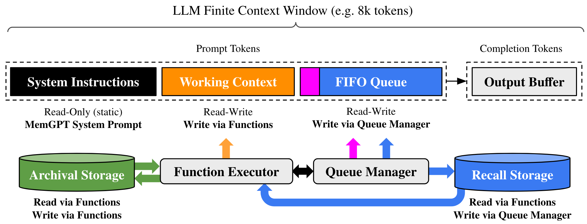

# MemGPT: Where Prefix Caching Fails and Substring Caching Succeeds

## Introduction

MemGPT is an innovative system that enables LLMs to manage their own memory, effectively creating "virtual context" that extends beyond the finite context window. By treating the context window like an operating system manages virtual memory, MemGPT allows persistent conversations and document analysis that would otherwise exceed token limits.

## MemGPT Memory Architecture



The architecture consists of three main layers:

### 1. LLM Context Window

The context window is divided into distinct sections:

| Section | Type | Description |
|---------|------|-------------|
| **System Instructions** | Read-Only (Static) | The MemGPT system prompt defining behavior and available functions |
| **Working Context** | Read-Write | Current user/persona information, updated via function calls |
| **FIFO Queue** | Read-Write | Recent conversation history, managed by Queue Manager |
| **Output Buffer** | Completion | LLM-generated responses |

### 2. External Storage Systems

- **Archival Storage**: Long-term memory for facts, documents, and persistent information
- **Recall Storage**: Searchable history of past conversations

### 3. Middleware Components

- **Function Executor**: Handles read/write operations to Archival Storage and Working Context
- **Queue Manager**: Controls the FIFO Queue eviction policy and Recall Storage writes

---

## Why Prefix Caching Fails for MemGPT

Prefix caching relies on **exact prefix matching**—reusing cached KV states only when the beginning of the prompt is identical. MemGPT's architecture fundamentally breaks this assumption:

### The Dynamic Context Problem

```
TURN 1 PROMPT                              TURN 2 PROMPT
═══════════════════                        ═══════════════════

┌───────────────────┐                      ┌───────────────────┐
│ System Instruct.  │ ← MATCH              │ System Instruct.  │
├───────────────────┤                      ├───────────────────┤
│ Working Context:  │                      │ Working Context:  │
│ User: "Alice"     │ ← MATCH              │ User: "Alice"     │
│                   │                      │ Born in: 1999     │ ← PREFIX BREAKS HERE ✗
│ Archival: Doc_A   │                      │ Archival: Doc_A   │ ← SAME CONTENT (CACHEABLE)
│ "The capital..."  │                      │ "The capital..."  │   
│ Func Definitions  │                      │ Func Definitions  │ ← SAME (CACHEABLE)
├───────────────────┤                      ├───────────────────┤
│ FIFO Queue:       │                      │ FIFO Queue:       │
│ [msg1, msg2, msg3]│                      │ [msg2, msg3, msg4]│ ← SHIFTED!
│ Recalled Conv     │                      │ Recalled Conv     │ ← CACHEABLE
└───────────────────┘                      └───────────────────┘
         │                                          │
         └──────────────┬───────────────────────────┘
                        ▼
        ┌───────────────────────────────────────┐
        │  ❌ PREFIX CACHE: very low reuse rate │
        │                                       │
        │  • Working Context updates break      │
        │    prefix after system instructions   │
        │  • FIFO Queue shifts every turn       │
        │  • Archival Docs & Func Defs same     │
        │    content but different positions    │
        └───────────────────────────────────────┘
```

### Key Reasons for Prefix Cache Failure

1. **Working Context Mutations**: The agent updates persona/user info via `core_memory_replace()` and `core_memory_append()`, changing mid-prompt content

2. **FIFO Queue Dynamics**: New messages push old ones out—the queue shifts every turn, destroying any prefix after system instructions

3. **Archival Retrieval Variability**: Retrieved documents appear at different positions depending on current queue length

4. **Function Call Results**: Tool outputs are injected dynamically, changing prompt structure unpredictably

---

## Non-Prefix (Substring) Caching: The Solution

Unlike prefix caching, **substring/block caching** can match and reuse **any contiguous token block** regardless of position. This is transformative for MemGPT:

### What Can Be Cached and Reused

```
CACHEABLE BLOCKS IN MEMGPT
══════════════════════════

┌─────────────────────────────────────────────────────────┐
│  ★ SYSTEM INSTRUCTIONS (~2000 tokens)                   │
│    Static across ALL turns → 100% reusable              │
├─────────────────────────────────────────────────────────┤
│  ★ WORKING CONTEXT (~2500 tokens)                       │
│    Including Archival Documents and Function Definitions│
│    Archival Documents and Function Definitions Cachable │
├─────────────────────────────────────────────────────────┤
│  ★ FIFO QUEUE (~1500 tokens)                            │
│    Recent Messages & Recalled Conversations             │
│    Recalled Conversations put into Working Context      │
│    Reusable if recalled                                 │
└─────────────────────────────────────────────────────────┘
```

### Position-Invariant Matching

```
TURN 1                                    TURN 5
═══════                                   ═══════

Position 0-2000:                          Position 0-2000:
┌─────────────────┐                       ┌─────────────────┐
│ System Instruct │ ◄─── CACHE HIT ────►  │ System Instruct │
└─────────────────┘                       └─────────────────┘

Position 2000-4500:                       Position 2000-4500:
┌─────────────────┐                       ┌─────────────────┐
│ Working Context │ ◄─── CACHE HIT ────►  │ Working Context │
│ (Archival Docs, │   (Archival Docs &    │ (Archival Docs, │
│  Func Defs)     │    Func Defs cached)  │  Func Defs)     │
└─────────────────┘                       └─────────────────┘

Position 4500-6000:                       Position 4500-6000:
┌─────────────────┐                       ┌─────────────────┐
│ FIFO Queue      │ ◄─── CACHE HIT ────►  │ FIFO Queue      │
│ (Recalled Conv) │   (different pos!)    │ (Recalled Conv) │
└─────────────────┘                       └─────────────────┘

    ✅ NON-PREFIX CACHE: Matches by CONTENT, not position
```

---

## Empirical Results: LMCache Agent Trace

The [LMCache MemGPT benchmark results](https://github.com/LMCache/lmcache-agent-trace/tree/main/memgpt_result) demonstrate the dramatic difference:


### Observed Cache Performance

| Caching Strategy | Cache Hit Rate | Explanation |
|------------------|----------------|-------------|
| **Prefix Caching** | ~43.9% | Only system prompt prefix matches |
| **Substring Caching** | ~93.4% | System prompt + archival docs + function defs all reused |

### Why Substring Caching Achieves High Hit Rates

1. **System Prompt Reuse**: The ~2000 token MemGPT system prompt is identical across all turns

2. **Archival Document Reuse**: When users ask follow-up questions, the same documents are retrieved—substring caching matches them regardless of FIFO queue length

3. **Function Schema Reuse**: Tool definitions embedded in the prompt are static

4. **Conversation Block Reuse**: When recalling past conversations from Recall Storage, previously processed message pairs can be matched

### Quantified Benefits

### What Can Be Cached and Reused

CACHEABLE BLOCKS + TYPICAL MEMGPT PROMPT (~6000 tokens)

| Block | Cacheability | Token share | Notes |
|-------|--------------|-------------|-------|
| System Instructions | CACHED | ~2000 | Static across turns (reusable) |
| Working Context(including Archival Documents and Function Definitions) | DYNAMIC | ~2500 | Archival Documents and Function Definitions Cachable |
| FIFO Queue (Recent Messages & Recalled Conversations) | DYNAMIC(recent) and CACHED(recalled) | ~1500 | Recent messages & Recalled Conversations putting into Working Context, reusable if recalled |

PREFIX CACHING:    ~2500 / 6000 = ~42% (often less due to working context).

SUBSTRING CACHING: > 5500 / 6000 = 90%+ (system + archival + functions)

---

## Conclusion

MemGPT's memory management paradigm—with its dynamic Working Context, shifting FIFO Queue, and variable archival retrievals—fundamentally breaks prefix caching assumptions. The content that could be reused (system prompts, retrieved documents, function definitions) appears at different positions across turns.

**Substring/block caching** solves this by matching token sequences regardless of position, enabling:
- **Higher cache hit rates** (93.4% vs 43.9%)
- **Reduced prefill latency** for repeated archival retrievals
- **Lower computational costs** for long-running agent sessions

For memory-augmented LLM agents like MemGPT, non-prefix caching isn't just an optimization—it's essential for practical deployment at scale.

---

## References

- [LMCache MemGPT Trace Results](https://github.com/LMCache/lmcache-agent-trace/tree/main/memgpt_result)
- [MemGPT: Towards LLMs as Operating Systems](https://memgpt.ai/)
