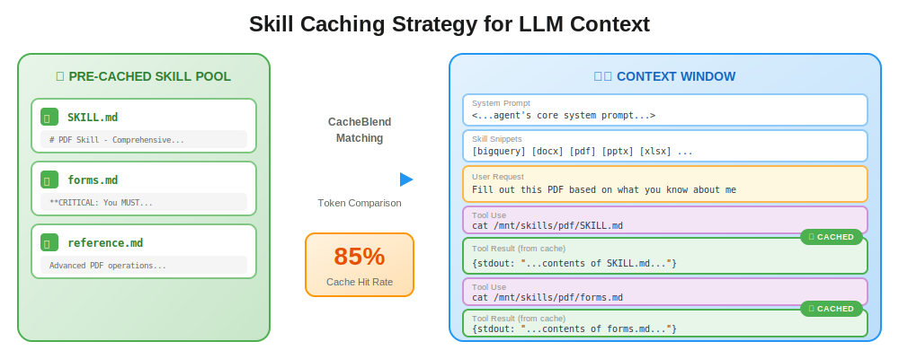
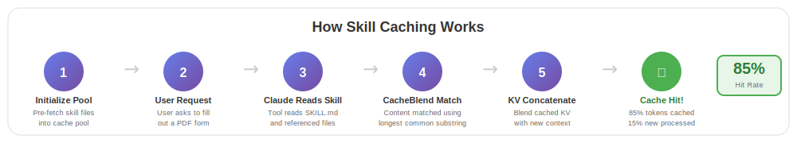
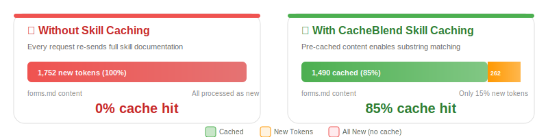

# Skill File Caching Strategy for LLM Context Editing

## Overview

This document describes a strategy for caching skill files (like `SKILL.md` and their referenced files) to enable efficient LLM prompt caching through context editing. By pre-processing and storing skill documentation in the correct format, we can achieve **85%+ cache hit rates** on skill-related content.



## Problem Statement

When LLM agents use skill files (e.g., PDF processing skills), the skill documentation is inserted into the user context. Without proper caching:
- Each request re-sends the full skill documentation
- No prefix matching occurs with previous requests
- Token costs and latency increase linearly

## Solution: Pre-cached Skill Pool

### 1. Skill Files to Cache

For each skill, cache the main skill file and all referenced files:

```
skills/pdf/
├── SKILL.md          # Main skill documentation
├── forms.md          # Referenced: PDF form filling guide
└── reference.md      # Referenced: Advanced PDF operations
```

### 2. Cache Format

Store skill files as plain text content:

```
**CRITICAL: You MUST complete these steps in order. Do not skip ahead to writing code.**

If you need to fill out a PDF form, first check to see if the PDF has fillable form fields.
```

The caching system handles format normalization automatically - no need to worry about line numbers, JSON escaping, or other format variations.

### 3. Implementation

#### Cache Initialization

```python
SKILL_URLS = [
    "https://raw.githubusercontent.com/anthropics/skills/main/skills/pdf/SKILL.md",
    "https://raw.githubusercontent.com/anthropics/skills/main/skills/pdf/forms.md",
    "https://raw.githubusercontent.com/anthropics/skills/main/skills/pdf/reference.md",
]

def initialize_skill_cache(urls: List[str]) -> List[str]:
    """Initialize cache with skill file contents."""
    cache = []
    for url in urls:
        content = fetch_url_content(url)
        if content:
            cache.append(content)
    return cache
```

#### Context Editing for Cache Hits

Traditional prefix caching requires skill content to appear at the **exact same position** in every prompt. However, with **CacheBlend**, we can concatenate pre-cached skill KV states with the existing context at any position:

```python
def construct_prompt_with_cacheblend(
    system_prompt: str,
    user_request: str,
    skill_content: str,
    skill_cache: KVCache  # Pre-computed KV cache for skill content
) -> Tuple[str, KVCache]:
    """
    Use CacheBlend to concatenate cached skill with existing context.
    
    Unlike prefix caching, CacheBlend allows inserting pre-cached
    skill content at ANY position in the prompt, not just the beginning.
    """
    # 1. Build the full prompt
    prompt = f"""System: You are Claude Code...

# User Request
{user_request}

# Tool Result: cat /mnt/skills/pdf/SKILL.md
{skill_content}
"""
    
    # 2. CacheBlend concatenates KV caches:
    #    - Compute KV for tokens BEFORE skill insertion point
    #    - REUSE pre-cached KV for skill_content (no recomputation!)
    #    - Compute KV for tokens AFTER skill content
    #    - Blend attention states at boundaries
    
    final_kv = cacheblend_concatenate(
        prefix_kv=compute_kv(prompt[:skill_start]),
        cached_kv=skill_cache,  # ← 85% of tokens skip prefill!
        suffix_kv=compute_kv(prompt[skill_end:])
    )
    
    return prompt, final_kv
```

**Key Advantage**: With CacheBlend, the skill content doesn't need to be at the prompt prefix. It can appear **after** dynamic content (user request, conversation history) and still achieve cache hits by concatenating pre-computed KV states.

### How Skill Caching Works



### 4. Cache Hit Analysis

With proper caching, we observed these results on skill-related requests:

| Record | Delta Words | Matched | Hit Rate |
|--------|-------------|---------|----------|
| forms.md content | 1,752 | 1,490 | **85.0%** |
| SKILL.md content | 1,315 | 836 | **63.6%** |
| Plan mode messages | 902 | 603 | **66.9%** |



### 5. Benefits

1. **Reduced Token Costs**: 85% of skill content hits cache → only 15% new tokens processed
2. **Lower Latency**: Cached prefixes enable faster response generation
3. **Consistent Behavior**: Pre-cached content ensures consistent skill documentation

## Best Practices

### DO:
- ✅ Cache all skill files and their references
- ✅ Place skill content early in prompts for maximum prefix matching
- ✅ Update cache when skill files change
- ✅ Use consistent prompt structure across requests

### DON'T:
- ❌ Insert dynamic content before skill documentation
- ❌ Modify skill content between requests
- ❌ Split skill files across different parts of the prompt

## File Structure

```
cache/
├── skills/
│   ├── pdf/
│   │   ├── SKILL.md
│   │   ├── forms.md
│   │   └── reference.md
│   └── other_skills/
│       └── ...
└── pool_index.json  # Metadata about cached entries
```

## Conclusion

By pre-caching skill files and structuring prompts for prefix matching, we can achieve significant cache hit rates (65-85%) on skill-related content. This reduces token costs and latency while maintaining consistent skill documentation across requests.

The key insight is that **prompt structure matters** - placing skill content early and consistently in prompts enables maximum prefix matching and cache efficiency.
